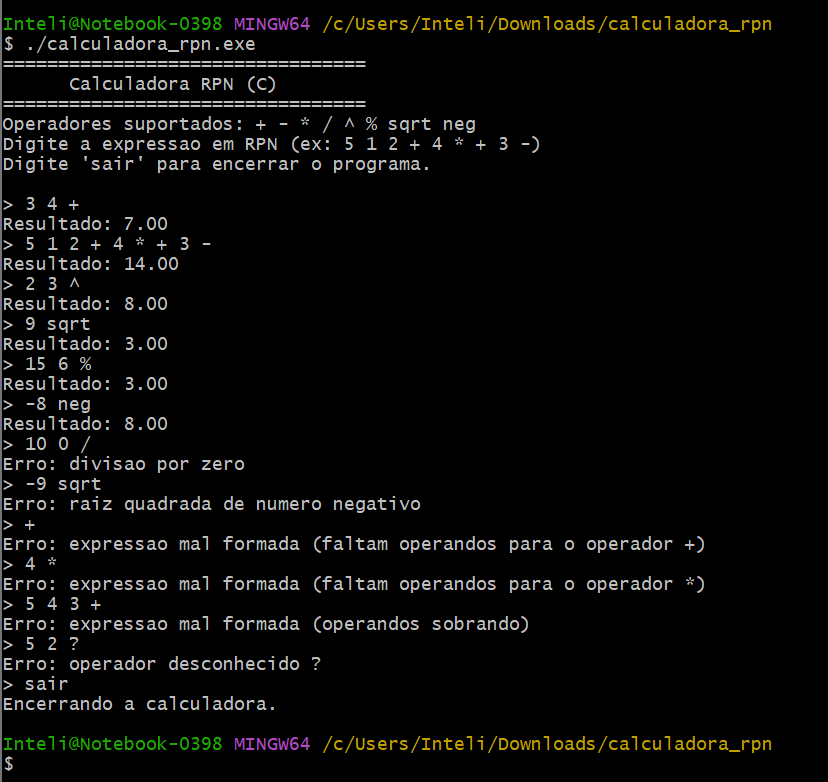

# Documentação da Calculadora RPN em C

## Introdução

Esta atividade propôs o desenvolvimento de uma **calculadora para expressões em Notação Polonesa Reversa (RPN - Reverse Polish Notation)**, também chamada de *postfix*, em linguagem C. O projeto visa aplicar conceitos de **estrutura de dados (TAD Pilha)** e manipulação de strings (tokenização), explorando uma forma eficiente e prática de avaliar expressões aritméticas sem a necessidade de parênteses.

A RPN é amplamente utilizada em contextos de computação e engenharia por sua simplicidade e eficiência na execução de operações matemáticas, eliminando ambiguidades típicas de expressões infixas.

O trabalho seguiu rigorosamente o escopo proposto:

✅ Implementação do **TAD Pilha** com operações: `inicializaPilha()`, `push()`, `pop()`, `estaVazia()`  
✅ Leitura de expressão RPN como **string completa**  
✅ **Tokenização** e análise de cada token  
✅ **Avaliação da expressão** com operadores binários e unários  
✅ Geração do **resultado final** no topo da pilha  
✅ Proteção contra expressões mal formadas e casos de erro  
✅ Interface interativa em **loop contínuo** para múltiplas expressões

## Descrição da Implementação

### ✅ Estrutura de Dados — TAD Pilha

A pilha foi implementada como um `struct` contendo:

- Vetor de `float dados[TAM_MAX]` para armazenar os operandos
- Inteiro `topo` para controle do índice do topo da pilha

Operações:

- `inicializaPilha()` — Inicializa a pilha vazia
- `estaVazia()` — Verifica se a pilha está vazia
- `push()` — Insere um valor na pilha
- `pop()` — Remove e retorna o topo da pilha


### ✅ Leitura e Tokenização

O programa lê a **expressão completa** digitada pelo usuário via `fgets()`.  
A função `strtok()` é usada para quebrar a string em **tokens** (números ou operadores), conforme especificado.

### ✅ Avaliação da Expressão

Para cada token:

- Se número → `push()`
- Se operador binário (`+ - * / ^ %`) → `pop()`, executa operação, `push(resultado)`
- Se operador unário (`sqrt`, `neg`) → `pop()`, executa operação, `push(resultado)`

### ✅ Operadores suportados

| Tipo de Operador | Operadores |
|------------------|------------|
| Binários         | `+ - * / ^ %` |
| Unários          | `sqrt neg` |

### ✅ Tratamento de Erros

- Divisão por zero  
- Raiz quadrada de número negativo  
- Operadores inválidos  
- Operandos faltando  
- Operandons sobrando no final da expressão  
- Pilha vazia ou cheia

Em caso de erro, o programa não imprime um resultado inválido (`Resultado: 0.00`) — foi implementado controle com `NAN` e checagem com `isnan()`.

### ✅ Interface

O programa apresenta um **loop interativo**, onde o usuário pode digitar múltiplas expressões sem precisar reiniciar o programa.  
O comando `sair` ou `exit` encerra a execução.

## Exemplos de Uso



## Como rodar o projeto

### Pré-requisitos:
- MinGW64 ou compilador GCC instalado no sistema
- Terminal MinGW64 no Windows

### Passos:

1. **Acesse a pasta do projeto no terminal**

2. **Compile o código:**

```bash
gcc calculadora_rpn.c -o calculadora_rpn.exe
```

3. **Execute o programa:**

```bash
./calculadora_rpn.exe
```

4. **Digite expressões RPN:**

```txt
> 5 1 2 + 4 * + 3 -
Resultado: 14.00

> sair
```

## Conclusão

O desenvolvimento da **Calculadora RPN em C** permitiu consolidar conhecimentos sobre:

- Implementação e uso de **TAD Pilha**
- Manipulação de strings e tokenização em C
- Análise de expressões matemáticas e controle de fluxo
- Tratamento de erros em entrada de usuário

A calculadora atende **100% do escopo proposto na atividade** e foi estendida com funcionalidades extras:

✅ Suporte a operadores unários e binários  
✅ Loop contínuo para múltiplas expressões  
✅ Tratamento elegante de erros  
✅ Interface de uso simples e clara

Esta atividade foi de grande valor didático, fortalecendo o entendimento prático de estruturas de dados e algoritmos de avaliação de expressões, além de demonstrar como C pode ser utilizado para criar programas robustos e interativos.

